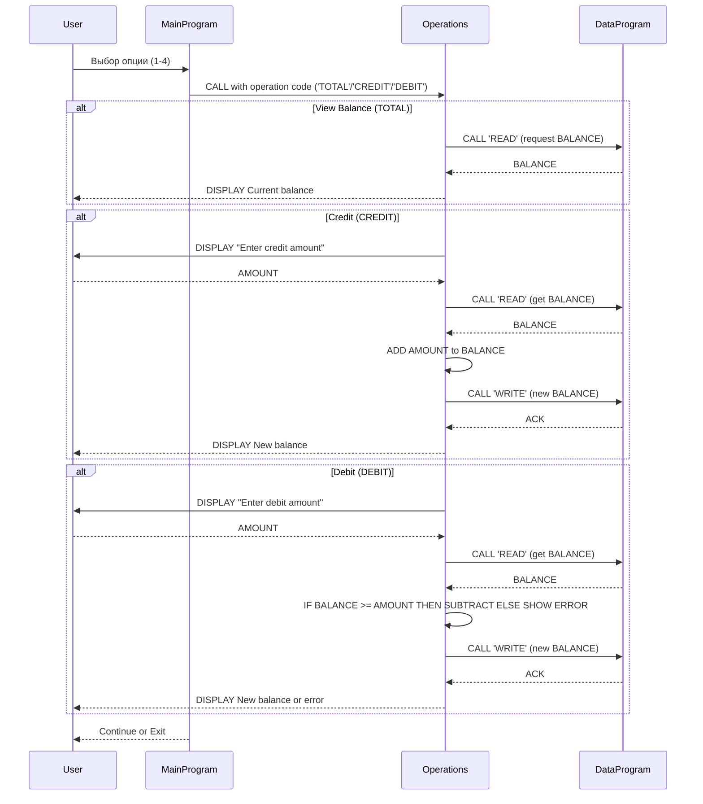

# Документация по COBOL-программам

Ниже описано назначение каждого COBOL-файла в `src/cobol`, ключевые процедуры/переменные и текущие бизнес-правила, связанные со студенческими счетами.

**Overview**:
- Репозиторий содержит простой учебный набор COBOL-программ для управления счётом студента: меню взаимодействия (`main.cob`), обработка операций (`operations.cob`) и модуль хранения/чтения баланса (`data.cob`).

**Файлы и их назначение**:
- `src/cobol/main.cob` — Program-ID: `MainProgram`.
  - Отвечает за пользовательское меню и цикл программы (`MAIN-LOGIC`).
  - Предоставляет варианты: просмотр баланса (1), зачисление (2), списание (3) и выход (4).
  - По выбору вызывает программу `Operations`, передавая строковый код операции: `'TOTAL '`, `'CREDIT'`, `'DEBIT '`.

- `src/cobol/operations.cob` — Program-ID: `Operations`.
  - Принимает входной параметр `PASSED-OPERATION` и выполняет соответствующую логику:
    - `TOTAL` — вызывает `DataProgram` с `'READ'` и отображает текущий баланс.
    - `CREDIT` — запрашивает сумму (`AMOUNT`), читает текущий баланс из `DataProgram`, добавляет сумму, записывает обновлённый баланс обратно через `DataProgram 'WRITE'` и отображает новый баланс.
    - `DEBIT` — запрашивает сумму, читает баланс, проверяет доступность средств (условие `FINAL-BALANCE >= AMOUNT`), при успешной проверке вычитает сумму и записывает результат; при недостатке средств выводится сообщение об ошибке.
  - Переменные: `OPERATION-TYPE`, `AMOUNT` (PIC 9(6)V99), `FINAL-BALANCE` (PIC 9(6)V99, по умолчанию 1000.00).

- `src/cobol/data.cob` — Program-ID: `DataProgram`.
  - Центральный небольшой модуль хранения: `STORAGE-BALANCE` (PIC 9(6)V99, VALUE 1000.00) действует как единственный источник правды для баланса во время выполнения программы.
  - Поддерживаемые операции через LINKAGE: `'READ'` — перемещает `STORAGE-BALANCE` в переданный параметр `BALANCE`; `'WRITE'` — записывает переданный `BALANCE` в `STORAGE-BALANCE`.
  - Важно: хранение — только в оперативной памяти (в пределах процесса). Нет постоянной записи на диск.

**Ключевые процедуры и переменные**:
- `MAIN-LOGIC` (`main.cob`) — главный цикл и UI-меню.
- `Operations` (процедура в `operations.cob`) — обработка типовых транзакций.
- `DataProgram` (в `data.cob`) — read/write интерфейс для баланса.
- `STORAGE-BALANCE` / `FINAL-BALANCE` — текущий баланс счета (по умолчанию 1000.00).
- `AMOUNT` — сумма для кредитования/дебетования (PIC 9(6)V99).

**Бизнес-правила (текущее поведение по реализации)**:
- Начальный/по умолчанию баланс равен `1000.00` (задан в `STORAGE-BALANCE` и `FINAL-BALANCE`).
- Кредитная операция: сумма добавляется к текущему балансу и результат сохраняется через `DataProgram 'WRITE'`.
- Дебетовая операция: разрешается только если текущий баланс >= запрашиваемой суммы (т.е. овердрафт не допускается).
- Операции обновляют единственное хранилище `STORAGE-BALANCE` (в памяти) последовательно — каждая запись перезаписывает текущее значение.
- Денежные поля используют формат `PIC 9(6)V99` — поддерживаются значения до `999999.99`.
- Нет явной валидации ввода: отрицательные суммы, нечисловой ввод или превышение диапазона не проверяются и могут приводить к некорректному поведению.
- Нет журнала транзакций и нет многопользовательской/параллельной защиты; одновременные изменения не контролируются.

**Ограничения и рекомендации**:
- Текущее "хранилище" — только память процесса. Для постоянства данных добавить запись в файл или БД.
- Добавить валидацию ввода: убедиться, что `AMOUNT` положителен и находится в допустимом диапазоне.
- Добавить журнал транзакций (timestamp, тип операции, сумма, старый/новый баланс) для аудита и восстановления.
- Ввести блокировки/транзакции для поддержки многопользовательской среды или использовать атомарные операции в БД.
- Форматирование вывода (например, валютный формат) и обработка ошибок ввода улучшат UX.

Если хотите, могу:
- добавить краткий пример взаимодействия (скрин- взаимодействия) или
- реализовать простую файловую персистентность для `DataProgram` и внести изменения в исходные файлы COBOL.

**Sequence Diagram**

Ниже диаграмма последовательности в формате Mermaid, показывающая поток данных между компонентами программы.

