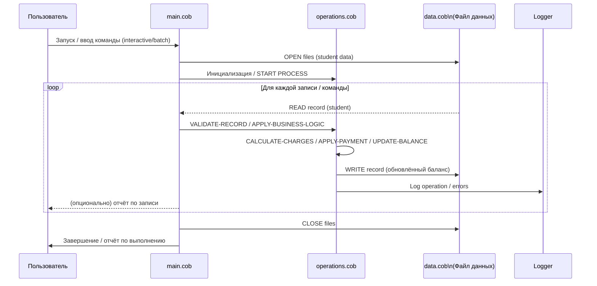

# Документация проекта COBOL — student accounts

## Обзор

В этой директории находится документация к исходникам COBOL из каталога `src/cobol`. Цель — коротко описать назначение каждого файла, ключевые функции/рутины и зафиксировать бизнес-правила, связанные со студенческими счетами.

## Структура файлов

- `src/cobol/data.cob`
  - Назначение: содержит описания файлов данных, структуры записей (FD/01-level), константы и общие рабочие области (WORKING-STORAGE). Отвечает за формат записи студента/счёта.
  - Ключевые элементы (ожидаемые):
    - Описание поля идентификатора студента (student-id).
    - Поля имени, баланса счёта, даты последнего платежа, статуса учёта.
    - Возможные рабочие переменные для сумм и флагов ошибок.
  - Примечание: если в реальном файле есть секции FILE-CONTROL / FD, они находятся здесь.

- `src/cobol/main.cob`
  - Назначение: точка входа программы (PROGRAM-ID), обработка инициализации и основной цикл выполнения. Обычно выполняет:
    - Загрузку/открытие файлов данных (INPUT/OUTPUT).
    - Инициализацию рабочих переменных.
    - Показ меню или обработку команд (batch/interactive).
    - Вызовы процедур/параграфов из `operations.cob` для выполнения операций.
  - Ключевые параграфы/процедуры (ожидаемые):
    - MAIN-PARA или BEGIN.
    - INIT / OPEN-FILES / CLOSE-FILES.
    - LOOP / PROCESS-RECORDS / END-OF-PROGRAM.

- `src/cobol/operations.cob`
  - Назначение: набор процедур и параграфов, реализующих бизнес-операции с учётными записями студентов.
  - Ключевые функции/рутены (ожидаемые):
    - CREATE-ACCOUNT — создать новый студенческий счёт.
    - UPDATE-BALANCE / APPLY-PAYMENT — применить платёж, скорректировать баланс.
    - CHARGE-FEE / CALCULATE-CHARGES — начисление сборов или пеней.
    - FIND-RECORD / READ-NEXT / WRITE-RECORD — операции ввода-вывода для записи студента.
    - VALIDATE-RECORD — проверка целостности/валидности данных перед записью.
  - Примечание: процедуры, вероятно, вызываются из `main.cob` и используют структуры из `data.cob`.

## Бизнес-правила для студенческих счетов (предполагаемые и общие)

Ниже перечислены ключевые бизнес-правила, которые документируются для понимания логики кода. Если фактические правила в коде отличаются, их следует обновить в этом файле.

1. Идентификация
   - Каждый студент имеет уникальный `student-id` — строка или числовой код. Дубликаты запрещены.

2. Баланс и платежи
   - Баланс счёта отражает текущую задолженность; положительное значение = задолженность (или наоборот — уточнить по реализации).
   - Платёж должен уменьшать задолженность; при применении платежа запускается `APPLY-PAYMENT`.
   - Частичные платежи допускаются: остаток сохраняется.

3. Начисления и пени
   - За просроченные счета может начисляться штраф (функция `CHARGE-FEE`).
   - Правило начисления: если с момента последнего платежа прошло N дней (N определяется в конфиге/константе), начисляется фиксированная или процентная плата.

4. Валидность записей
   - Поля `student-id`, `name` и `balance` являются обязательными.
   - Если при валидации обнаружена ошибка, запись не сохраняется, и устанавливается флаг ошибки/логируется сообщение.

5. Закрытие учетной записи
   - Аккаунт может быть помечен как `CLOSED` только при нулевом или отрицательном балансе в соответствии с бизнес-правилом (уточнить: допустим ли отрицательный баланс как переплата).

6. Безопасность и интегритет данных
   - Операции чтения/записи должны выполняться в транзакционном стиле: чтение -> изменение -> запись с проверкой успешности.
   - При ошибке ввода-вывода — попытка отката/логирования и переход к следующей записи.

## Контракт (в 2–4 пунктах)

- Вход: файлы данных студентов (описанные в `data.cob`) и управляющие команды (меню или batch-параметры).
- Выход: обновлённые файлы данных, отчёты по операциям и лог ошибок.
- Ошибки: валидация данных и ошибки ввода-вывода должны приводить к логированию и безопасному завершению операции.
- Успех: правильное изменение баланса и корректная запись обратно в файл.

## Частые крайние случаи (edge cases)

- Пустой или отсутствующий файл данных — инициализация новых файлов.
- Некорректный формат записи (обрезанные поля) — пропуск/логирование.
- Платёж больше текущей задолженности (переплата) — корректная обработка и возможное отражение как кредит на счёте.
- Конкурентный доступ к файлам (в старых COBOL-программах редко) — внимательно с блокировками/синхронизацией, если применимо.

## Как собрать и запустить (быстрый пример)

Предполагается использование GNU COBOL (opencobol/gcobol). Пример команд:

```bash
# Компиляция
cobc -x -o student_app src/cobol/main.cob src/cobol/data.cob src/cobol/operations.cob

# Запуск
./student_app
```

Если у вас другой компилятор/окружение — адаптируйте команды.

## Примечания и допущения

- Документация создана на основе имён файлов и обычной структуры COBOL-проектов. Я сделал несколько разумных допущений о содержимом (см. выше). Если хотите, могу прочитать реальные файлы `src/cobol/*.cob` и синхронизировать эту документацию с фактическим содержимым.
- Рекомендуется добавить в репозиторий файл `CONTRIBUTING.md` с правилами изменений данных и форматом записи логов.

## Дальше (рекомендуемые улучшения)

- Добавить в `docs` диаграмму структуры данных (примеры записей) на основе реальных `FD` из `data.cob`.
- Автоматические тесты: добавить простой набор unit/integration тестов (скрипты, которые запускали бы программу на тестовых файлах данных и проверяли ожидаемые изменения балансов).

---
Файл сгенерирован автоматически как базовая документация. Для точной синхронизации можно запустить обновление на основе фактических определений полей в `src/cobol/data.cob`.

## Диаграмма последовательностей

Ниже — последовательная диаграмма в формате mermaid, показывающая поток данных и вызовов между компонентами приложения:


```mermaid
sequenceDiagram
  participant User as Пользователь
  participant App as main.cob
  participant Ops as operations.cob
  participant Data as data.cob\n(Файл данных)
  participant Log as Logger

  User->>App: Запуск / ввод команды (interactive/batch)
  App->>Data: OPEN files (student data)
  App->>Ops: Инициализация / START PROCESS

  loop Для каждой записи / команды
    Data-->>App: READ record (student)
    App->>Ops: VALIDATE-RECORD / APPLY-BUSINESS-LOGIC
    Ops->>Ops: CALCULATE-CHARGES / APPLY-PAYMENT / UPDATE-BALANCE
    Ops->>Data: WRITE record (обновлённый баланс)
    Ops->>Log: Log operation / errors
    App-->>User: (опционально) отчёт по записи
  end

  App->>Data: CLOSE files
  App->>User: Завершение / отчёт по выполнению
```

Эта диаграмма отражает типичный batch/interactive поток: `main.cob` управляет запуском и I/O, `operations.cob` выполняет бизнес-логику и операции над записями, а `data.cob` описывает структуру и хранение записей студентов.
